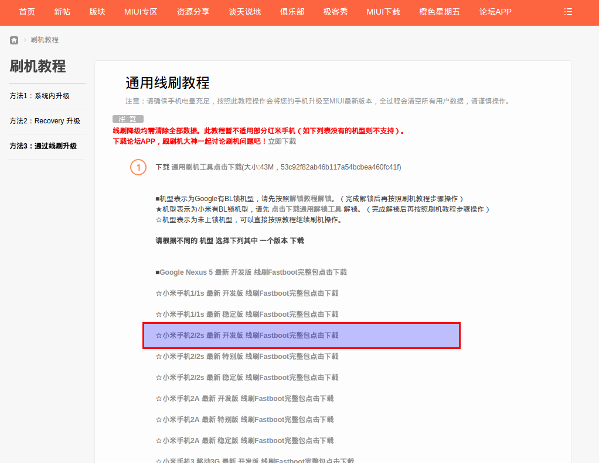
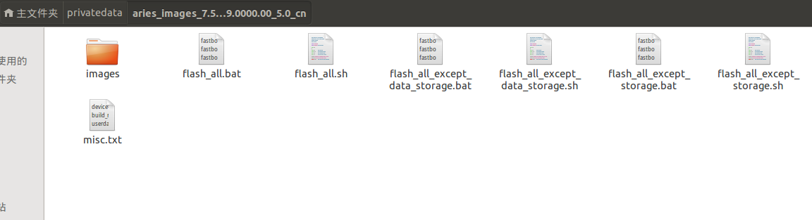
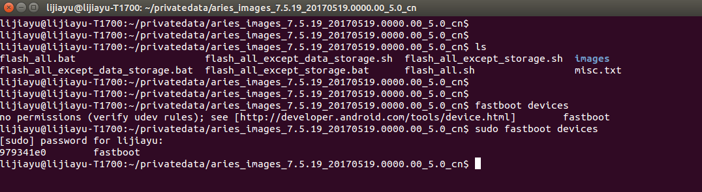
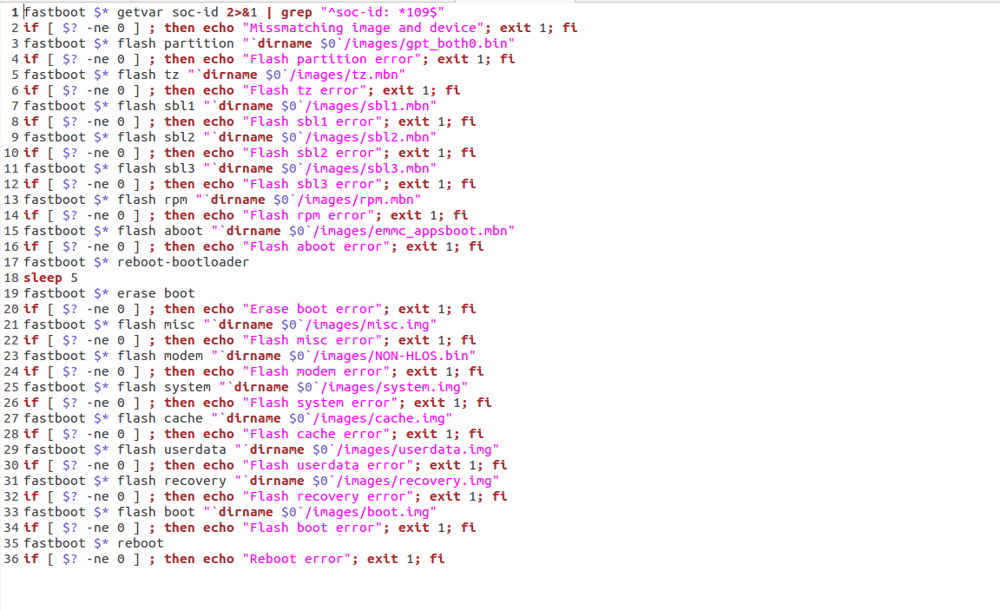
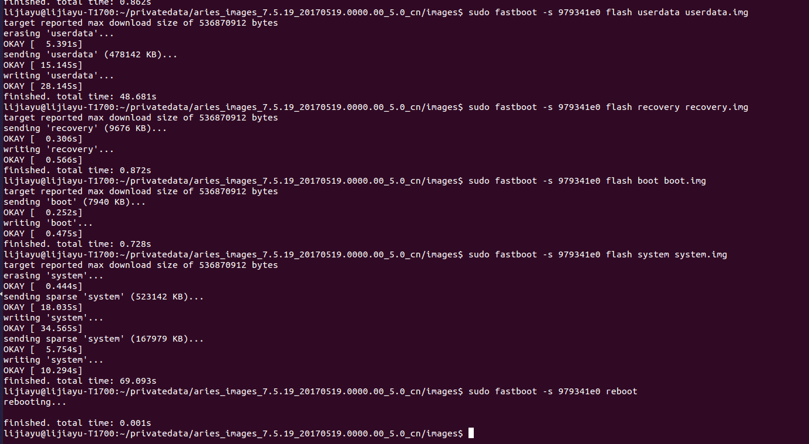

# Ubuntu下使用fastboot刷小米手机  
MIUI8 发布已经好一段时间了，一直想体验一下。手头上刚好有一台封尘已久的小米2,[小米官网](http://www.miui.com/shuaji-393.html)上提供了系统内升级、Recovery升级、线刷三种升级方式。前面两种都是完整的Update包升级，线刷则是通过fastboot个工具把数据刷到各个分区上。官网提供的教程是基于windows的，今天刚好没有带手提过来，公司使用的电脑装的是Ubuntu系统。正好可以试下直接在Ubuntu下使用fastboot工具刷机。  
## 一、前往[官网](http://www.miui.com/shuaji-393.html)下载线刷包和刷机工具
   

## 二、下载fastboot工具  
直接在终端输入：  
`sudo apt-get install android-tools-fastboot`

## 三、刷机  
**将升级包解压到指定目录下**  
  
**手机进入Recovery模式**  
长按音量下+电源键进入，然后通过USB连接上电脑。连接到电脑后使用以下命令查看手机的串口标识符：  
`sudo fastboot devices`    
    
注意此命令需要管理员权限，必须加`sudo`。这里的手机串口标识为：`979341e0`。
**通过fastboot刷机**   
使用编辑工具打开`flash_all.sh`文件，可以看到下面fastboot命令集合   
  
其中`$*` 是指定的设置串号标识符号，上面已经通过命令查出来了。 `dirname $0`是上面解压升级包的所在目录。为了简短目录长度我们先进入images目录，则对应的命令如下:
`sudo fastboot -s 979341e0 flash partition gpt_both0.bin`
`sudo fastboot -s 979341e0 flash tz tz.mbn`
`sudo fastboot -s 979341e0 flash sbl1 sbl1.mbn`
`sudo fastboot -s 979341e0 flash sbl2 sbl2.mbn`
`sudo fastboot -s 979341e0 flash sbl3 sbl3.mbn`
`sudo fastboot -s 979341e0 flash rpm rpm.mbn`
`sudo fastboot -s 979341e0 flash aboot emmc_appsboot.mbn`
`sudo fastboot -s 979341e0 reboot-bootloader`
`sudo fastboot -s 979341e0 erase boot`
`sudo fastboot -s 979341e0 flash misc misc.img`
`sudo fastboot -s 979341e0 flash modem NON-HLOS.bin`
`sudo fastboot -s 979341e0 flash system system.img`
`sudo fastboot -s 979341e0 flash cache cache.img`
`sudo fastboot -s 979341e0 flash userdata userdata.img`
`sudo fastboot -s 979341e0 flash recovery recovery.img`
`sudo fastboot -s 979341e0 flash boot boot.img`
`sudo fastboot -s 979341e0 reboot `  
接着在终端中输入对应命令即可:  

